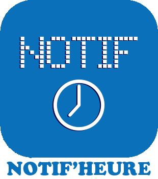

   

### Master:   

### Develop:   

# Présentation:

Plugin , permettant de piloter le **notif'heure** . ( Sources du notif'heure disponible sur https://byfeel.info )

  []

# Documentation du plugin:

[présentation](docs/fr_FR/presentation.md)  
[configuration](docs/fr_FR/configuration.md)  
[faq](docs/fr_FR/faq.md)   
[changelog](docs/fr_FR/changelog.md)

# Documentation complète:

