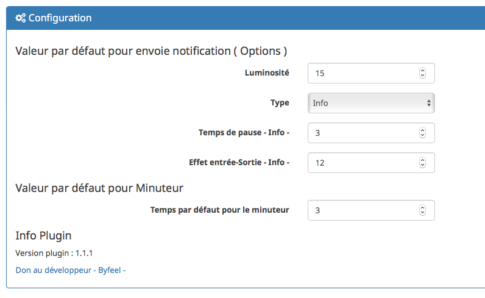
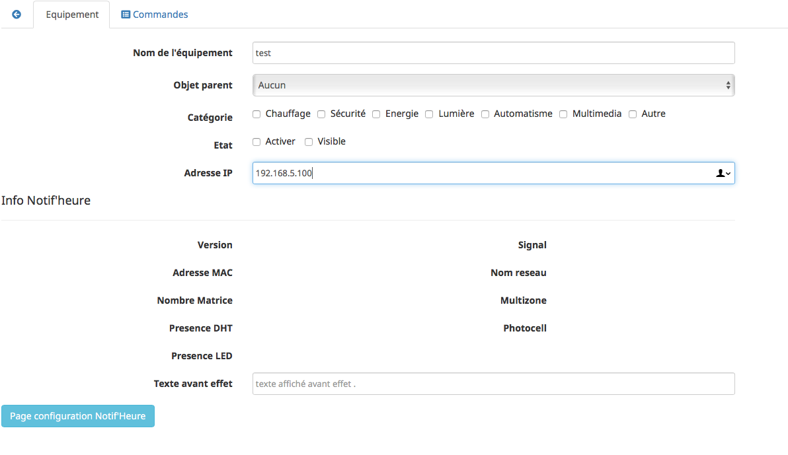
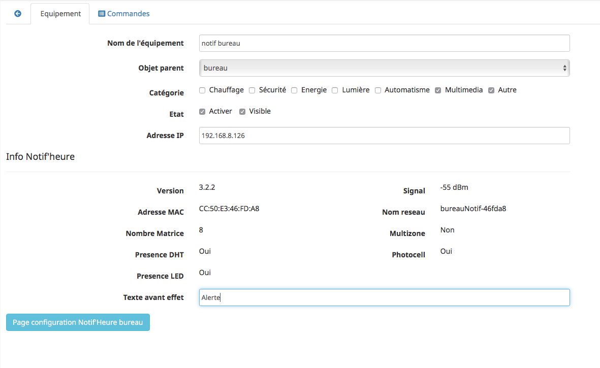

# Configuration

La partie configuration du plugin permet :

* Configuration plugin
* configuration equipement
* lien vers page config du NotifHeure

### Configuration du plugin

Après téléchargement du plugin, il faut l’activer, celui-ci ne nécessite aucune autre configuration.  
En option il est possible de paramétrer des valeurs par défaut , pour tous les notifheure.

  

* Valeur de la luminosité  
* Le type de notification  
* Temps de pause ( pour la commande info )  
* Effet d'entrée et sortie par défaut  
* Temps par défaut pour le minuteur

### Configuration des équipements

Pour ajouter un Notif'Heure dans votre Jeedom ou NextDom , rendez vous dans la catégorie objet connectés et lancer le plugin NotifFheure .
Puis ajouter

Pour configurer un nouvel equipement ,  de renseigner un nom d'equipement et indiquer **l'adresse IP** du norifheure .

Puis sauvegarder votre équipement.  
Le plugin , va se connecter à votre Notif'Heure , et récupérer les infos de configuration de ce dernier.

Vous avez la possibilité sur cette page :  
  * De vous rendre sur la page de configuration du Notif'Heure ( Si vous modifiez une option , pensez à retourner sur votre équipement et à sauvegarder de nouveau ce dernier , afin d'effectuer les éventuels mis à jour ).

  * De renseigner le texte à _"afficher"_ avant les effets ( par exemple : PAC )
