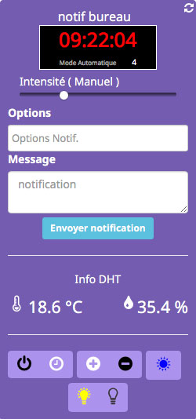

# Description

Plugin , permettant de piloter le Notif'Heure. Pour vous installer un Notif'heure , vous pouvez vous rendre sur le site de byfeel.
http://byfeel.info

# Market

Retrouvez le sur le [Market](https://www.jeedom.com/market/index.php?v=d&p=market&type=plugin&&name=NotifHeure) Jeedom

# Prévisualisation

# Forum

Lien vers le [Forum](https://www.jeedom.com/forum/viewtopic.php?t=xxxx)

~~Remplacer `t=xxxx` par le bon numéro de forum~~
