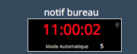
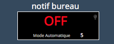
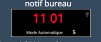
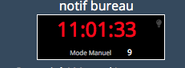
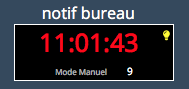
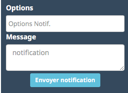
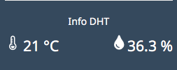
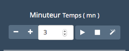

# Utilisation  
## Le widget  
Le widget est décopmosé en six zones , en fonction des options installés dans le notif'heure.  
  * Bloc 1 :  
    
  La partie haute représente l'etat du notif'heure en fonction des commandes envoyés .  
    * OFF   
           
    * Affichage des secondes  
        
    * Masquage des secondes  
        
    * Mode automatique ou Manuel  
        
    * Temoin led on / off  
           

  * Bloc 2 : Réglage de l'intensité pour le mode Manuel ( des que l'on modifie ce paramétrage le Notif'Heure passe en Mode Manuel pour la luminositée ).
  l'info Mode manuel  et valeur , s'affiche dans le bloc 1.  

  

  * Bloc 3 : Options et Notification à envoyer.  

  

  Les Options possibles sont ( séparation possibles : , ou ; ou - ou : ) . Par exemple : _lum=8 , type=INFO , fio = 24 , important_   
  indiquera une luminosité de 8 , affichage de type INFO avec un effet en entrée et sortie de 24 , et ajoutera le tag important afin de le marquer pour l'historique.

  * **lum** : de 0 à 15 pour indiquer une valeur de luminositée  
  * **type** : Type d’animation ou de comportement BLINDS ,PAC ou OPENING : pour des effets d’animation avant la notification affiche l’info “txt” , contenu dans la variable txt.  
    * INFO : associé au champ “pause” permet d’afficher un texte court  entre 0 et 60 secondes.  
    * FIX : Affiche un texte court , en permanence . Une nouvelle notification envoyée , enleverra le texte. Si , on désire effacer sans afficher de texte , il faut utiliser le mot clé ” **!Clear!**” dans le champ message.  
  * **txt** : Un mot a afficher avant les effets d’animation ( la valeur par défaut renseigner dans la page de création sera utilisé si l'option txt n'existe pas ).  
  * **pause** : Associé à INFO , permet de définir un temps d’affichage entre 0 et 60 secondes.  
  * **flash** : pour activer le flash lumineux avant notification ( si LED présente )  
  * **important** : Permet de rajouter un tag sur le message pour l’historisation et notification LED si présente.
  * **fi**,**fo** ou **fio** : permet de choisir un effet pour la commande de type INFO . fi pour l’effet d’entrée , fo pour l’effet de sortie et fio pour définir le même effet en entrée et sortie. Par exemple fio=26,type=info permet un scrolling de la droite vers la gauche.  

  #### Listes Codes effets (fi,fo, fio)  

|Code| Désignation        |
|:--:|--------------------|
|0|	Apparition / disparition par point
|1|	Affichage sans effet
|2|	Effet scanner horizontal
|3|	Scrolling gauche
|4|	Ne fait rien ( sert pour le fix )
|5|	Apparition / disparition effet efface
|6|	balayage verticale
|7|	Scrolling diagonal haut-gauche
|8|	Scrolling Haut
|9|	Fondu
|10|	Effet curseur ouverture
|11|	Apparition / Disparition par le bas
|12|	Scrolling diagonal haut-droite
|13|	Blinds ( effet persienne )
|14|	PAC MAN    /   PAC MAN + fantôme
|15|	Ouverture / Fermeture
|16|	Apparition / Disparition par le haut
|17|	effet scanner vertical
|18|	Scrolling diagonal bas-gauche
|19|	curseur horizontal
|20|	balayage horizontal
|21|	Brouillage
|22|	Entrelaçement
|23|	Fermeture / Ouverture
|24|	Effet curseur fermeture
|25|	Scrolling diagonal haut-gauche
|26|	Scrolling droite
|27|	effet tranche
|28|	Scrolling bas

  Vous pouvez retrouvez la documentation compléte sur mon site : https://byfeel.info

* Bloc 4 : Retrouvez les infos du DHT , si celui ci sont présentes dans le NotifHeure ( les infos sont réactualisés toutes les 30 minutes ).  

    

* Bloc 5 : Les commandes

     

  Dans l'ordre :
  * Off : Supprime affichage de l'Horloge  
  * On(reveil) : Affiche l'horloge  
  * Plus : Affiche les secondes si masqué
  * Moins : Masque les secondes  
  * Auto : Active le mode Auto  
  * Led On : Allume la led  
  * Led Off : Eteind la led  

* Bloc 6 : Le minuteur   
   
  * Le - et le + pour incrementer le temps du minuteur . L'option increment dans "Paramètres optionnels sur la tuile" permet de modifier l'unité d'increment par défaut : 1  
  * Bouton play : Pour lancer le minuteur  
  * Bouton Stop : Pour annuler le minuteur  
  * Bouton "magic" : Pour afficher / Masquer le minuteur
  
